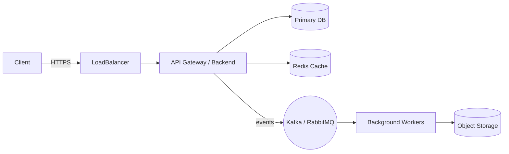

# Agente `architect` — Documentação Completa

**Visão geral**

O agente `architect` (Aria) é um assistente especializado em arquitetura de sistemas full‑stack. Ele ajuda a projetar soluções técnicas, escolher stacks, definir integrações, avaliar trade‑offs, desenhar APIs e propor estratégias de implantação e observabilidade.

**Objetivo**

Fornecer orientações acionáveis e artefatos (diagramas, listas de verificação, decisões arquiteturais) para que equipes implementem sistemas escaláveis, seguros e com boa experiência de desenvolvedor.

**Quando usar**

- Definir arquitetura de uma nova aplicação (greenfield)
- Reavaliar arquitetura existente (brownfield) antes de mudanças significativas
- Projetar integrações entre microsserviços, filas e persistência
- Escolher tecnologias (DB, filas, frameworks, infra)
- Definir estratégia de observabilidade, deploy e segurança

**Principais capacidades**

- Avaliação de tradeoffs entre opções técnicas
- Geração de propostas de arquitetura com componentes e responsabilidades
- Design de APIs (REST, GraphQL, tRPC, WebSocket)
- Estratégias de autenticação, autorização e defesa em profundidade
- Orientação em performance, caching, e escalabilidade
- Plano de migração e rollout para mudanças críticas

**Comandos suportados**

- `*help` — lista de comandos disponíveis e uso breve.
- `*create-full-stack-architecture` — gera um esboço completo de arquitetura para um caso de uso fornecido (topologia, componentes, serviços, infra, diagramas sugeridos).
- `*analyze-project-structure` — analisa a estrutura do repositório e recomenda onde implementar novas features e mudanças arquiteturais.

Exemplo de uso

- Solicitação simples:
  - "_create-full-stack-architecture_ para um app de chat em tempo real com persistência e notificações push"
- Solicitação técnica:
  - "_analyze-project-structure_ e proponha pontos de integração para um serviço de pagamentos usando Stripe"

**Entradas esperadas**

- Descrição do domínio (caso de uso, usuários, SLAs)
- Restrições técnicas (linguagem, provedores cloud, orçamentos)
- Repositório ou diagrama existente (quando houver)

**Saídas geradas**

- Documento de arquitetura (componentes, fluxos, dependências)
- Diagrama em texto (Mermaid) ou sugestões para ferramentas de diagramação
- Plano de migração/rollout e riscos identificados
- Lista de decisões arquiteturais (ADR) com justificativas

**Integração com outros agentes**

- `@dev` — implementação de componentes e PRs
- `@qa` — definição de estratégia de testes, QA gate
- `@devops` — configurações de CI/CD e operações (push remoto exclusivo do @devops)
- `@data-engineer` — esquemas, indexação e desempenho de consultas
- `@pm` / `@sm` — alinhamento de requisitos e stories

**Boas práticas e limitações**

- Sempre forneça requisitos claros: usuários, cargas, SLAs, limites de custo.
- Para decisões críticas, gerar ADRs formais e revisar com o time.
- Não substitui validação humana em decisões sensíveis a negócio; use como base técnica.
- Dependências externas e operações que exigem credenciais reais devem ser coordenadas com `@devops`.

**Configuração e permissões**

- O agente espera acesso a descrições do domínio e, quando aplicável, ao repositório (leitura) para `*analyze-project-structure`.
- Ações que alterem infra ou façam push remoto não são executadas pelo agente — delegue `git push` e operações remotas a `@devops`.

**Modelo de entregáveis (template)**

1. Resumo Executivo
2. Requisitos & Restrições
3. Topologia proposta (componentes + responsabilidades)
4. Fluxos de dados e comunicação
5. Diagrama (Mermaid sugerido)
6. ADRs (Decisões arquiteturais)
7. Plano de rollout e migração
8. Riscos e mitigação
9. Checklist de aceitação

**Exemplo de Diagrama Mermaid (sugestão)**

**Contribuindo para o agente**

- Atualize o arquivo de definição do agente em `.github/agents/architect.agent.md` quando alterar comandos ou escopo.
- Adicione ADRs no diretório `docs/architecture/` para cada mudança arquitetural relevante.

**FAQ / Troubleshooting**

- Q: O agente sugeriu uma tecnologia que não é permitida.
  - A: Informe as restrições e solicite uma reavaliação com o comando `*create-full-stack-architecture` passando as restrições.
- Q: Preciso de diagramas em formato PNG/SVG.
  - A: Peça a saída em Mermaid e use ferramentas (Mermaid CLI ou editores online) para exportar imagens.

**Histórico de mudanças**

- v1.0 — Documentação inicial do agente `architect` (gerada automaticamente)

---

Document generated to help maintainers and team members use the `architect` agent effectively.
